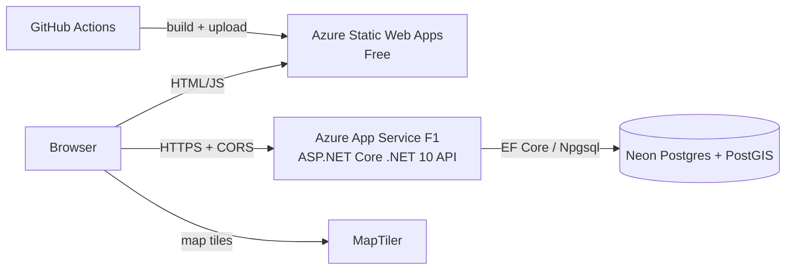
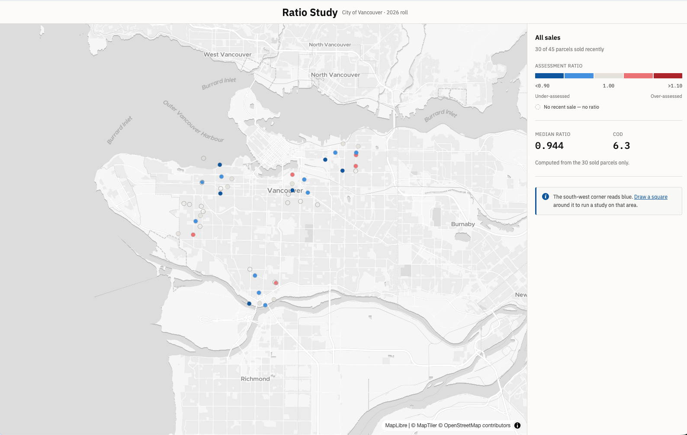
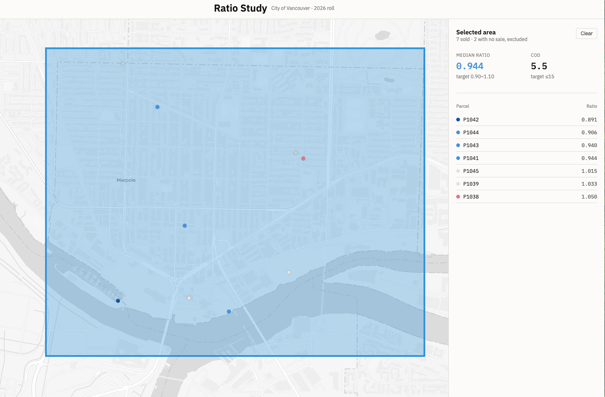
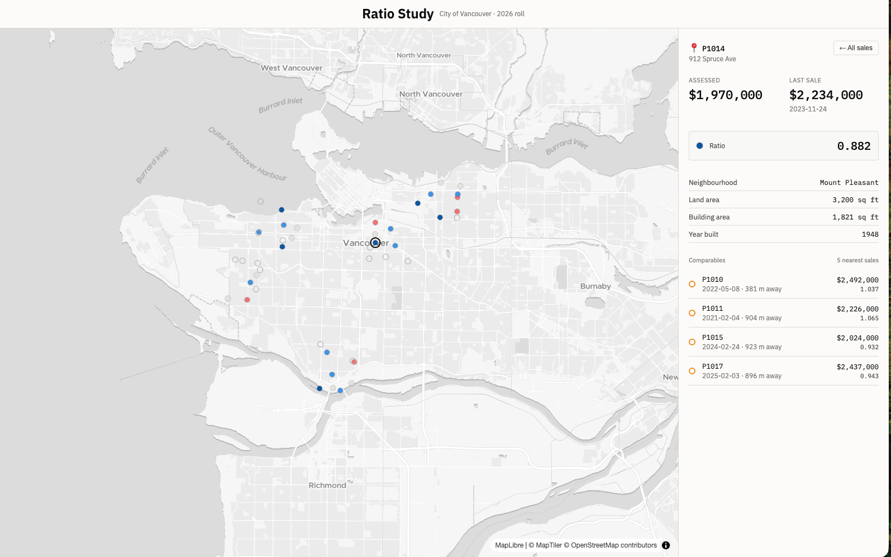

# ParcelRatioWeb

A small property-assessment tool: parcels on a map coloured by assessment ratio (assessed value / sale price), a drawn square gives the area's median ratio and COD, and any sold parcel shows its comparable sales.

## Live demo

- **Site:** https://ashy-sand-0e541f41e.2.azurestaticapps.net
- **API:** https://parcel-ratio-api-nick-gqeccuf3hsekged4.westus3-01.azurewebsites.net/parcels
- Runs on free tiers, so the first load can take 10 to 20 seconds (App Service cold start, database waking up). Hosting is Azure free-account services and may be switched off after the free period.

Try it: click a coloured dot for its comparables, or use the square tool and draw over Marpole (south of the map): 7 sold parcels, median ratio 0.944, COD 5.5.

### Architecture



### Screenshots





### Deploying

Pushing to `main` runs `.github/workflows/azure-static-web-apps.yml` (pnpm build, upload `dist/parcel-ratio-web/browser`) using the `AZURE_STATIC_WEB_APPS_API_TOKEN` secret. The production API URL is in `src/environments/environment.ts`. The API repo allows this site through the `Cors__AllowedOrigins__0` app setting.

### Teardown

1. Azure portal: delete resource group `rg-parcel-ratio` (App Service and Static Web App).
2. Neon console: delete the project.
3. GitHub: delete the `AZURE_STATIC_WEB_APPS_API_TOKEN` secret and disable the workflow.

## Local development

This project was generated using [Angular CLI](https://github.com/angular/angular-cli) version 22.1.7.

## Development server

To start a local development server, run:

```bash
ng serve
```

Once the server is running, open your browser and navigate to `http://localhost:4200/`. The application will automatically reload whenever you modify any of the source files.

## Code scaffolding

Angular CLI includes powerful code scaffolding tools. To generate a new component, run:

```bash
ng generate component component-name
```

For a complete list of available schematics (such as `components`, `directives`, or `pipes`), run:

```bash
ng generate --help
```

## Building

To build the project run:

```bash
ng build
```

This will compile your project and store the build artifacts in the `dist/` directory. By default, the production build optimizes your application for performance and speed.

## Running unit tests

To execute unit tests with the [Vitest](https://vitest.dev/) test runner, use the following command:

```bash
ng test
```

## Running end-to-end tests

For end-to-end (e2e) testing, run:

```bash
ng e2e
```

Angular CLI does not come with an end-to-end testing framework by default. You can choose one that suits your needs.

## Additional Resources

For more information on using the Angular CLI, including detailed command references, visit the [Angular CLI Overview and Command Reference](https://angular.dev/tools/cli) page.
